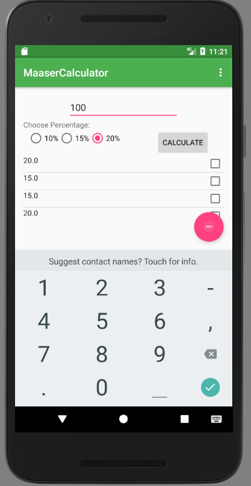

# MaaserCalculator
**Maaser Calculator - Android app - group project with Atara Ney for Touro College class Special Topics in Computer Science (Android Application Development).** 

Our Android app allows users to input an amount of money that they have earned and choose a percentage of 10%, 15%, or 20% of their earnings to donate to charity (Maaser). 
The app creates a list of your charity amounts, and once you donate those amounts to charity, you can click the PAY button to clear them from the list. 

